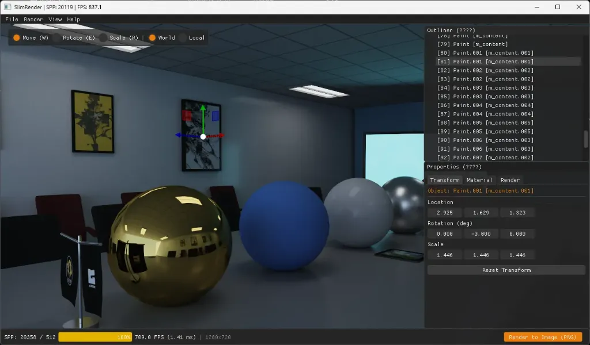
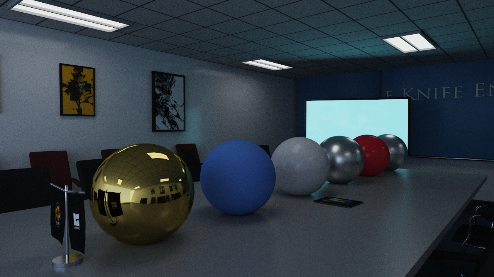
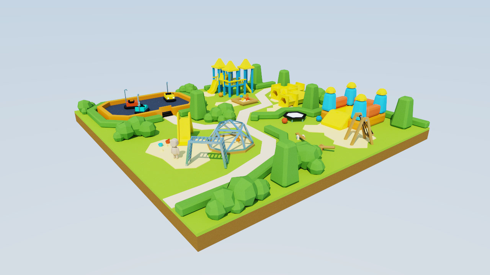
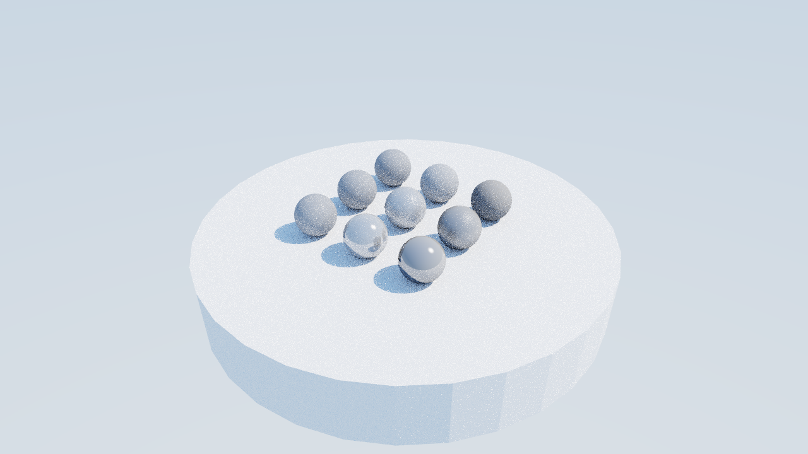

# SlimRender

[](https://en.wikipedia.org/wiki/C%2B%2B20)
[](https://vulkan.lunarg.com/)
[](LICENSE)

基于现代 **Vulkan 1.3+ 硬件光线追踪 (Ray Query + BDA)** 与 **C++20** 实现的极简高性能路径追踪渲染器，配备类似 **Blender 的 3D DCC 编辑器交互界面**。

> 💡 **项目起源与讨论**：
> - 灵感讨论：[知乎 - 如何实现一个现代的 Vulkan 光线追踪渲染器？](https://www.zhihu.com/question/9874420979)
> - 架构参考：[gkNextEngine](https://github.com/gameknife/gkNextEngine)（参考其硬件光线追踪、Compute Shader 内联 Ray Query 与 Buffer Device Address 架构设计）

---

## 📸 编辑器与渲染预览

### 🎨 Blender 风格 3D 交互视口编辑器

*(支持 3D 视口三轴 Gizmo 变换、大纲视图 Outliner、属性面板 Transform/Material/Render 实时调节与 SPP 累积进度指示)*

### 🖼️ 物理真实感路径追踪样张

| 室内复杂会议室场景 (`conf_room.glb`) | 户外游乐场场景 (`playground.glb`) |
| :---: | :---: |
|  |  |

| PBR 材质球渐变测试 (`pbr.glb`) |
| :---: |
|  |

---

## ✨ 特色与设计理念

### 1. 现代 Vulkan 硬件光追架构（参考 gkNextEngine）
- **内联光线追踪 (Inline Ray Query)**：
  - 参考 gkNextEngine 的 `FHardwareRayTracer` 设计，在 Compute Shader (`assets/shaders/pathtrace.comp`) 中通过 `rayQueryEXT` 调度多反弹全局光照。
  - **无需管理 Shader Binding Table (SBT)** 与复杂的 Ray Tracing Pipeline，大幅简化了管线与状态生命周期，同时保持硬件级 BVH 求交性能。
- **Buffer Device Address (BDA) 零绑定访问**：
  - 开启 `VK_KHR_buffer_device_address` 特性。
  - 顶点缓冲、索引缓冲、材质参数、实例矩阵等全部转换为 64 位 GPU 虚拟地址，通过 128 字节的 `VkPushConstants` 直接传给着色器，实现近乎零绑定（Bindless）的高性能数据检索。
- **两层硬件加速结构 (BLAS + TLAS)**：
  - 按 Mesh 几何创建 Bottom-Level AS (BLAS)，通过 `VkAccelerationStructureInstanceKHR` 构建 Top-Level AS (TLAS)。
  - 支持在运行时交互变换物体时毫秒级在线更新 TLAS。
- **物理着色与重要性采样**：
  - **Microfacet GGX**：根据粗糙度对半程向量进行重要性采样以模拟金属/高光反射；
  - **Cosine-weighted Hemisphere**：半球余弦加权漫反射采样；
  - **Next-Event Estimation (NEE)**：每步反弹对定向太阳光执行直接光阴影射线求交；
  - **动态物理天空**：基于天顶与地平线颜色渐变的分析型物理天空模型；
  - **俄罗斯轮盘赌 (Russian Roulette)**：无偏终止低贡献路径，保证渲染效率；
  - **渐进式抗锯齿累积 (Progressive Accumulation)**：亚像素抖动多采样平滑收敛，内置 ACES Film 色调映射与 sRGB 伽马校正。

### 2. Blender 风格 DCC 交互编辑器 (Dear ImGui + ImGuizmo)
- **Blender 经典深色主题**：石板灰基调与 Blender 标志性橙色高亮（`#E87D0D`），提供沉浸式 3D DCC 工作流体验；
- **视口 3D 操纵手柄 (ImGuizmo)**：在视口中直接通过三轴 Gizmo 交互平移、旋转与缩放选中的模型实例；
- **大纲视图 (Outliner)**：实时树状展示 glTF 场景中的所有节点与物体实例，点击即可选中并切换激活对象；
- **属性面板 (Properties)**：
  - **Transform**：实时调整并数字微调位置、旋转（欧拉角）、缩放，支持一键重置；
  - **Material**：实时调节当前选中物体的 BaseColor 拾色器、Metallic 金属度、Roughness 粗糙度、Emissive 自发光；
  - **Light & Render Settings**：实时微调 Max Bounces（1~16）、太阳光方向与仰角、阳光强度/颜色、天空环境光；
- **高质量离线出图 (Render to Image)**：设定目标采样数（如 512 / 1024 SPP），累积完成后自动通过 `stb_image_write` 导出为高保真 PNG 图像并保存至本地 `renders/` 目录。

### 3. 极简依赖与工程架构 (零强制 vcpkg 依赖)
- **原生 Win32 窗口系统**：完全摆脱 SDL3/GLFW/Qt 等庞大依赖，直接封装轻量 Win32 窗口与高精度鼠标键盘事件交互；
- **免包管理器配置**：
  - 数学库 `glm` 由 CMake `FetchContent` 自动拉取；
  - `cgltf.h`、`stb_image.h`、`stb_image_write.h`、`imgui` 与 `ImGuizmo` 均以单头文件/源码形式内嵌于 `third_party/`，开箱即编；
  - 仅需安装 Vulkan SDK，无需配置复杂的 vcpkg / conan。

### 4. 完整的 glTF 2.0 资产与相机支持
- 支持 `.gltf` 与 `.glb`（二进制）格式；
- 自动解析场景层级、顶点属性、法线贴图、PBR 材质因子与贴图；
- 支持 **文件拖拽 (Drag & Drop)**：直接将任意 `.glb`/`.gltf` 文件拖入视口即可秒级加载；
- **智能相机就位**：
  - 若模型内嵌有 Camera 节点（如 Blender 导出的多视角或室内场景），自动应用内嵌相机的位置与朝向；
  - 若无相机，自动根据物体包围盒中心与半径进行外接球平滑居中构图；
- **健全的格式告警**：对未解压的 Draco 压缩网格或不支持的 WebP 贴图输出明确告警，杜绝黑屏与静默失败。

---

## 📁 项目目录结构

```
SlimRender/
├── CMakeLists.txt                      # 根目录 CMake 配置 (含 glslc 自动编译着色器)
├── .gitignore                          # 完善的构建与产物忽略规则
├── docs/
│   └── images/                         # 预览截图 (editor_ui, conf_room, playground, pbr)
├── assets/
│   ├── models/                         # 测试模型 (conf_room.glb, playground.glb, pbr.glb)
│   └── shaders/
│       ├── pathtrace.comp              # 核心路径追踪着色器 (RayQuery + BDA + GGX PBR)
│       └── pathtrace.comp.spv          # 编译生成的 SPIR-V 字节码
├── third_party/
│   ├── cgltf/cgltf.h                   # 轻量级单头文件 glTF 2.0 解析库
│   ├── stb/                            # stb_image.h & stb_image_write.h
│   ├── imgui/                          # Dear ImGui 核心与 Win32 / Vulkan 后端
│   └── ImGuizmo/                       # 3D 变换 Gizmo 控件
└── src/
    ├── main.cpp                        # 程序入口、主渲染循环、文件拖拽与动态重载
    ├── Core/
    │   ├── Common.hpp                  # 平台定义、Vulkan/GLM 头文件与 VK_CHECK 宏
    │   └── Window.hpp / .cpp           # Win32 原生窗口、Win32 消息循环与输入捕获
    ├── Scene/
    │   ├── Camera.hpp / .cpp           # 交互式观察 / 飞行摄像机 (FPS/Orbit 模式)
    │   ├── SceneTypes.hpp              # GPU 场景数据结构 (Vertex, Material, PushConstants)
    │   └── GltfLoader.hpp / .cpp       # glTF 加载、内嵌相机提取、BLAS/TLAS 构建
    ├── UI/
    │   └── EditorUI.hpp / .cpp         # Blender 风格编辑器界面 (Outliner, Properties, Gizmo)
    └── Vulkan/
        ├── VulkanContext.hpp / .cpp    # Vulkan 实例、物理设备与扩展特性管理 (RayQuery, BDA)
        ├── VulkanBuffer.hpp / .cpp     # 缓冲区分配、Staging 内存上传与 DeviceAddress 获取
        ├── VulkanImage.hpp / .cpp      # 图像分配、纹理采样器与 Pipeline Barrier 布局转换
        ├── VulkanSwapchain.hpp / .cpp  # 交换链管理、图像呈现与多帧同步 (Frames in flight)
        ├── AccelerationStructure.hpp/.cpp # 硬件光追 BLAS 底层与 TLAS 顶层加速结构构建
        └── PathTracer.hpp / .cpp       # 计算管线管理、描述符集合绑定与多帧累积渲染
```

---

## 🛠️ 构建与运行

### 环境要求
- **操作系统**：Windows 10 / 11 64-bit
- **显卡**：支持 Vulkan 1.3 硬件光线追踪的 GPU（NVIDIA RTX 20/30/40/50 系列，或支持 Ray Query 的 AMD RX 6000+ 显卡）
- **开发工具**：
  - [Vulkan SDK](https://vulkan.lunarg.com/) 1.3 或以上（确保 `glslc` 在 PATH 中）
  - Visual Studio 2022 (MSVC C++20)
  - CMake 3.22 或以上

### 1. 配置与编译
打开 PowerShell 或 VS Developer Command Prompt：
```powershell
# 1. 生成工程 (自动拉取 GLM 并编译 SPIR-V 着色器)
cmake -B build -S .

# 2. 编译 Release 目标
cmake --build build --config Release
```

### 2. 运行渲染器
```powershell
# 运行默认测试材质球模型
.\build\Release\SlimRender.exe assets/models/pbr.glb

# 运行复杂室内会议室模型
.\build\Release\SlimRender.exe assets/models/conf_room.glb

# 运行户外游乐场模型
.\build\Release\SlimRender.exe assets/models/playground.glb

# 打开任意外部 glTF/GLB 模型（也支持直接拖入视口）
.\build\Release\SlimRender.exe "D:/path/to/your/model.glb"
```

---

## 🎮 交互控制说明

| 操作按键 | 对应功能 |
| :--- | :--- |
| **鼠标右键拖动** | 旋转观察视角 (Yaw / Pitch) |
| **鼠标中键拖动** 或 **Shift + 右键拖动** | 平移摄像机 (Pan) |
| **鼠标滚轮** | 摄像机前后推拉 / 缩放 (Zoom / Dolly) |
| **W / A / S / D** | 摄像机平移（前 / 左 / 后 / 右） |
| **Q / E** | 摄像机垂直升降（下移 / 上移） |
| **Shift 键 (按住)** | 3x 快速飞行移动 |
| **Ctrl 键 (按住)** | 0.3x 精细微调移动 |
| **W / E / R 键** | 切换当前 Gizmo 操作模式（平移 / 旋转 / 缩放） |
| **文件拖入窗口** | 直接加载外部 `.gltf` / `.glb` 场景 |
| **F1 键** | 切换隐藏 / 显示 UI 界面遮罩 |
| **ESC 键** | 退出程序 |

---

## 📚 参考与致谢

- [gkNextEngine](https://github.com/gameknife/gkNextEngine) - 现代 Vulkan 硬件光追设计与实现参考
- [知乎讨论问题](https://www.zhihu.com/question/9874420979) - 架构设计与极简实现的灵感来源
- [Dear ImGui](https://github.com/ocornut/imgui) - 优秀的即时模式图形界面库
- [ImGuizmo](https://github.com/CedricGuillemet/ImGuizmo) - 直观易用的 3D 变换操纵手柄
- [cgltf](https://github.com/jkuhlmann/cgltf) - 极简快速的 C99 glTF 2.0 解析器
- [stb](https://github.com/nothings/stb) - 经典的单头文件图像读写库

